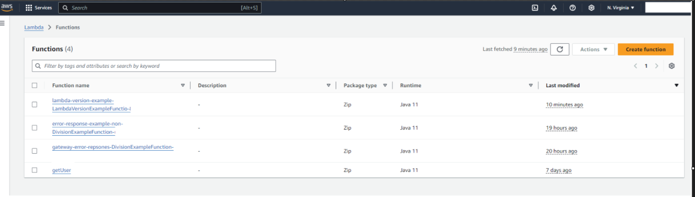
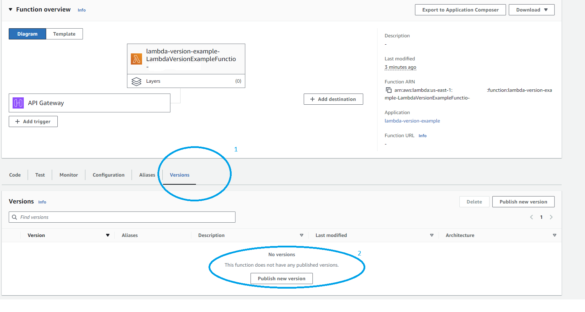
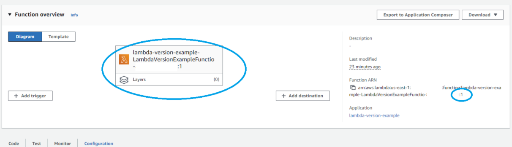
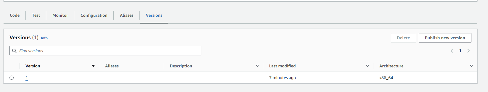
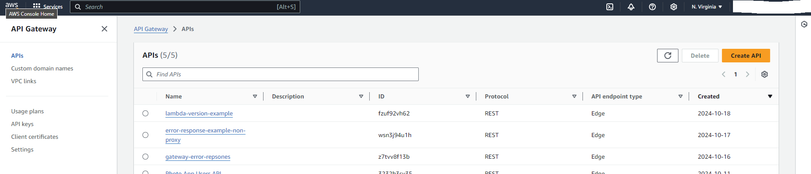
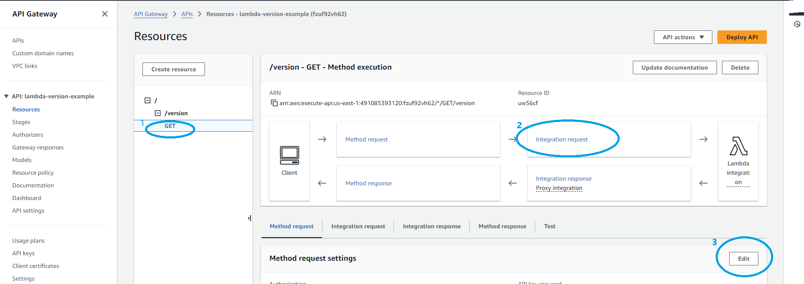
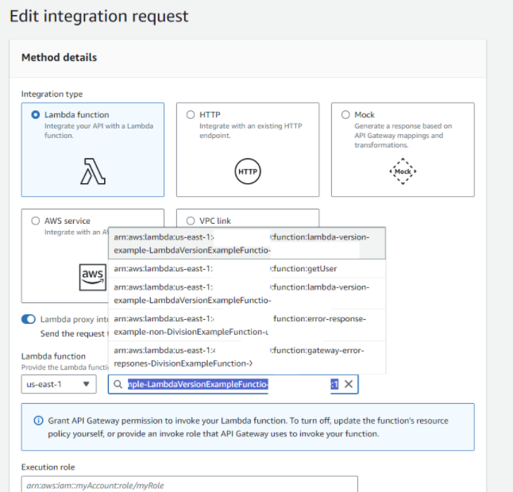
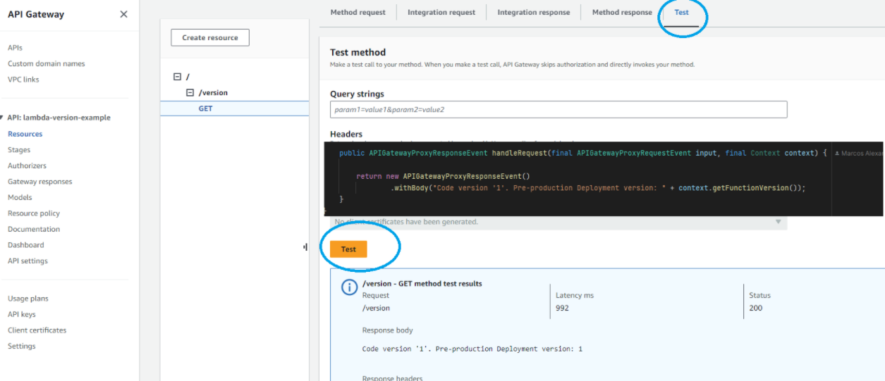

# Study Notes

## Table of Contents
- [Publishing a New Lambda Version on AWS](#publishing-a-new-lambda-version-on-aws)
- [Assigning the New Lambda Version to its Endpoint](#assigning-the-new-lambda-version-to-its-endpoint)
- [Important Notes on Lambda Versions](#important-notes-on-lambda-versions)

## Publishing a New Lambda Version on AWS
First, we **build** and **deploy** our code, then go to the AWS Lambda console and select the Lambda function we just deployed:



1. Select **Versions**:  
   

2. Choose **Publish new version**.
    - Even though the Version Description is optional, a version number (e.g., `1`) is automatically assigned. You can add a description to help identify the version, but this is not the version number itself. AWS will create a snapshot of the current function and name it **version 1**.
    - The ARN of the Lambda will be updated with `:1` (or the appropriate version number) added to the end:

   

Now, when we go back to the **Versions** section of the Lambda function, we’ll see this:



## Assigning the New Lambda Version to its Endpoint
1. Go to the **API Gateway console** and select your API:

   

2. Navigate to the HTTP method > **Integration Request** > **Edit**:  
   

3. Edit the function name or alias by adding the correct version (e.g., `:1`) to the Lambda function name:

   

    - **Note**: Instead of hardcoding the version number (e.g., `:1`), it’s often better to create an alias (like `:prod` or `:dev`). This allows you to manage versions more easily in the future.

4. Finally, test the changes:

   

## Important Notes on Lambda Versions
- **Version Immutability**:  
  Once we publish a version of a Lambda function, **we cannot modify the code** for that version. This ensures stability for any service or API using that specific version.

- **Creating New Versions**:  
  If we need to update the code, we can publish a new version (e.g., `version 2`), and then assign the new version to the API Gateway or other services. You do not need to recreate the function from scratch.

- **Using Aliases**:  
  Instead of directly assigning specific version numbers (like `:1`), consider using **aliases** (e.g., `:prod`, `:dev`). This way, we can update the alias to point to a new version without changing the API Gateway configuration every time.

- If we need to use another version of this Lambda, we can repeat the steps under [Assigning the New Lambda Version to its Endpoint](#assigning-the-new-lambda-version-to-its-endpoint).


<br>
<br>
<br>
<br>
<br>
<br>
<br>
# lambda-version-example

This project contains source code and supporting files for a serverless application that you can deploy with the SAM CLI. It includes the following files and folders.

- HelloWorldFunction/src/main - Code for the application's Lambda function.
- events - Invocation events that you can use to invoke the function.
- HelloWorldFunction/src/test - Unit tests for the application code. 
- template.yaml - A template that defines the application's AWS resources.

The application uses several AWS resources, including Lambda functions and an API Gateway API. These resources are defined in the `template.yaml` file in this project. You can update the template to add AWS resources through the same deployment process that updates your application code.

If you prefer to use an integrated development environment (IDE) to build and test your application, you can use the AWS Toolkit.  
The AWS Toolkit is an open source plug-in for popular IDEs that uses the SAM CLI to build and deploy serverless applications on AWS. The AWS Toolkit also adds a simplified step-through debugging experience for Lambda function code. See the following links to get started.

* [CLion](https://docs.aws.amazon.com/toolkit-for-jetbrains/latest/userguide/welcome.html)
* [GoLand](https://docs.aws.amazon.com/toolkit-for-jetbrains/latest/userguide/welcome.html)
* [IntelliJ](https://docs.aws.amazon.com/toolkit-for-jetbrains/latest/userguide/welcome.html)
* [WebStorm](https://docs.aws.amazon.com/toolkit-for-jetbrains/latest/userguide/welcome.html)
* [Rider](https://docs.aws.amazon.com/toolkit-for-jetbrains/latest/userguide/welcome.html)
* [PhpStorm](https://docs.aws.amazon.com/toolkit-for-jetbrains/latest/userguide/welcome.html)
* [PyCharm](https://docs.aws.amazon.com/toolkit-for-jetbrains/latest/userguide/welcome.html)
* [RubyMine](https://docs.aws.amazon.com/toolkit-for-jetbrains/latest/userguide/welcome.html)
* [DataGrip](https://docs.aws.amazon.com/toolkit-for-jetbrains/latest/userguide/welcome.html)
* [VS Code](https://docs.aws.amazon.com/toolkit-for-vscode/latest/userguide/welcome.html)
* [Visual Studio](https://docs.aws.amazon.com/toolkit-for-visual-studio/latest/user-guide/welcome.html)

## Deploy the sample application

The Serverless Application Model Command Line Interface (SAM CLI) is an extension of the AWS CLI that adds functionality for building and testing Lambda applications. It uses Docker to run your functions in an Amazon Linux environment that matches Lambda. It can also emulate your application's build environment and API.

To use the SAM CLI, you need the following tools.

* SAM CLI - [Install the SAM CLI](https://docs.aws.amazon.com/serverless-application-model/latest/developerguide/serverless-sam-cli-install.html)
* Java11 - [Install the Java 11](https://docs.aws.amazon.com/corretto/latest/corretto-11-ug/downloads-list.html)
* Maven - [Install Maven](https://maven.apache.org/install.html)
* Docker - [Install Docker community edition](https://hub.docker.com/search/?type=edition&offering=community)

To build and deploy your application for the first time, run the following in your shell:

```bash
sam build
sam deploy --guided
```

The first command will build the source of your application. The second command will package and deploy your application to AWS, with a series of prompts:

* **Stack Name**: The name of the stack to deploy to CloudFormation. This should be unique to your account and region, and a good starting point would be something matching your project name.
* **AWS Region**: The AWS region you want to deploy your app to.
* **Confirm changes before deploy**: If set to yes, any change sets will be shown to you before execution for manual review. If set to no, the AWS SAM CLI will automatically deploy application changes.
* **Allow SAM CLI IAM role creation**: Many AWS SAM templates, including this example, create AWS IAM roles required for the AWS Lambda function(s) included to access AWS services. By default, these are scoped down to minimum required permissions. To deploy an AWS CloudFormation stack which creates or modifies IAM roles, the `CAPABILITY_IAM` value for `capabilities` must be provided. If permission isn't provided through this prompt, to deploy this example you must explicitly pass `--capabilities CAPABILITY_IAM` to the `sam deploy` command.
* **Save arguments to samconfig.toml**: If set to yes, your choices will be saved to a configuration file inside the project, so that in the future you can just re-run `sam deploy` without parameters to deploy changes to your application.

You can find your API Gateway Endpoint URL in the output values displayed after deployment.

## Use the SAM CLI to build and test locally

Build your application with the `sam build` command.

```bash
lambda-version-example$ sam build
```

The SAM CLI installs dependencies defined in `HelloWorldFunction/pom.xml`, creates a deployment package, and saves it in the `.aws-sam/build` folder.

Test a single function by invoking it directly with a test event. An event is a JSON document that represents the input that the function receives from the event source. Test events are included in the `events` folder in this project.

Run functions locally and invoke them with the `sam local invoke` command.

```bash
lambda-version-example$ sam local invoke HelloWorldFunction --event events/event.json
```

The SAM CLI can also emulate your application's API. Use the `sam local start-api` to run the API locally on port 3000.

```bash
lambda-version-example$ sam local start-api
lambda-version-example$ curl http://localhost:3000/
```

The SAM CLI reads the application template to determine the API's routes and the functions that they invoke. The `Events` property on each function's definition includes the route and method for each path.

```yaml
      Events:
        HelloWorld:
          Type: Api
          Properties:
            Path: /hello
            Method: get
```

## Add a resource to your application
The application template uses AWS Serverless Application Model (AWS SAM) to define application resources. AWS SAM is an extension of AWS CloudFormation with a simpler syntax for configuring common serverless application resources such as functions, triggers, and APIs. For resources not included in [the SAM specification](https://github.com/awslabs/serverless-application-model/blob/master/versions/2016-10-31.md), you can use standard [AWS CloudFormation](https://docs.aws.amazon.com/AWSCloudFormation/latest/UserGuide/aws-template-resource-type-ref.html) resource types.

## Fetch, tail, and filter Lambda function logs

To simplify troubleshooting, SAM CLI has a command called `sam logs`. `sam logs` lets you fetch logs generated by your deployed Lambda function from the command line. In addition to printing the logs on the terminal, this command has several nifty features to help you quickly find the bug.

`NOTE`: This command works for all AWS Lambda functions; not just the ones you deploy using SAM.

```bash
lambda-version-example$ sam logs -n HelloWorldFunction --stack-name lambda-version-example --tail
```

You can find more information and examples about filtering Lambda function logs in the [SAM CLI Documentation](https://docs.aws.amazon.com/serverless-application-model/latest/developerguide/serverless-sam-cli-logging.html).

## Unit tests

Tests are defined in the `HelloWorldFunction/src/test` folder in this project.

```bash
lambda-version-example$ cd HelloWorldFunction
HelloWorldFunction$ mvn test
```

## Cleanup

To delete the sample application that you created, use the AWS CLI. Assuming you used your project name for the stack name, you can run the following:

```bash
sam delete --stack-name lambda-version-example
```

## Resources

See the [AWS SAM developer guide](https://docs.aws.amazon.com/serverless-application-model/latest/developerguide/what-is-sam.html) for an introduction to SAM specification, the SAM CLI, and serverless application concepts.

Next, you can use AWS Serverless Application Repository to deploy ready to use Apps that go beyond hello world samples and learn how authors developed their applications: [AWS Serverless Application Repository main page](https://aws.amazon.com/serverless/serverlessrepo/)
